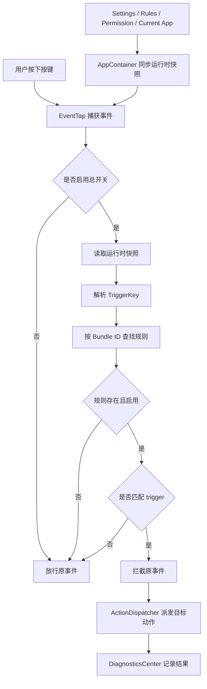

# ChatKey 技术设计（MVP v1）

## 1. 目标

为 ChatKey MVP 提供一版实现基线，重点解决：

- 如何监听按键
- 如何识别当前前台应用
- 如何按应用命中规则
- 如何把触发键转换为目标动作
- 如何把失败状态对用户可见化

## 2. 技术选型

推荐采用原生 macOS 技术栈：

- 语言：Swift
- UI：SwiftUI
- 系统集成：AppKit
- 数据持久化：`Codable + JSON`（MVP）或 `SwiftData`（后续）
- 键盘事件：Core Graphics Event Tap
- 权限检测：Accessibility API
- 文案国际化：`Localizable.strings` 或 String Catalog

原因：

- 对菜单栏应用支持自然
- 对系统事件处理能力最强
- 发布和权限模型最直接

## 3. 系统架构

MVP 可拆成以下模块：

### 3.1 AppShell

职责：

- 应用生命周期
- 菜单栏图标与菜单
- 设置窗口打开
- 启动状态管理

### 3.2 PermissionManager

职责：

- 检查辅助功能权限
- 提示用户授权
- 输出权限状态给 UI

建议接口：

```swift
protocol PermissionManaging {
    func isAccessibilityTrusted() -> Bool
    func requestAccessibilityPermission()
}
```

### 3.3 FrontmostAppMonitor

职责：

- 监听前台应用变化
- 获取当前应用名称、Bundle ID、图标

建议接口：

```swift
struct AppDescriptor: Codable, Equatable, Identifiable {
    let id: String
    let name: String
    let bundleId: String
}
```

### 3.4 RuleStore

职责：

- 规则增删改查
- 本地持久化
- 提供命中查询

MVP 建议：

- 将规则存为应用支持目录下的 JSON 文件
- 便于调试、导入导出和手工修复

### 3.5 EventTapService

职责：

- 全局监听键盘事件
- 判断是否为目标触发键
- 查询当前前台应用命中的规则
- 拦截并重发目标事件

### 3.6 ActionDispatcher

职责：

- 将抽象动作转换为系统事件
- 负责发送：
  - `Return`
  - `Shift + Return`
  - `Command + Return`
  - `Option + Return`
  - `Control + Return`

### 3.7 DiagnosticsCenter

职责：

- 记录最近命中的规则
- 记录最近一次处理结果
- 对 UI 提供状态说明

当前实现：

- 输出监听器状态：`active / inactive / failed`
- 输出最近一次被转换的按键事件
- 输出最近一次关键错误

### 3.8 LocalizationManager

职责：

- 管理当前界面语言
- 提供“跟随系统 / 简体中文 / English”三种模式
- 对 UI 暴露语言切换状态

建议配置：

- `system`
- `zh-Hans`
- `en`

### 3.9 UpdateManager

职责：

- 按设置决定是否自动检查更新
- 支持手动检查更新
- 拉取 GitHub Releases 最新版本信息
- 对 UI 暴露“当前版本 / 最新版本 / 是否可更新”
- 打开 GitHub Releases 页面

### 3.10 KeyEventRouting

职责：

- 将底层按键事件解析为 `TriggerKey`
- 根据前台应用和规则列表计算命中结果
- 保持纯逻辑，可单元测试

当前实现原则：

- 只处理 `Return` 家族组合键
- 不直接访问 UI 或持久化层
- 对外只返回 `RoutingDecision`

### 3.11 AppContainer

职责：

- 作为运行时装配根
- 把 `PermissionManager`、`FrontmostAppMonitor`、`SettingsStore`、`RuleStore` 的状态同步给 `EventTapService`
- 避免在 EventTap 回调里直接依赖 `@MainActor` UI 对象

## 4. 数据模型

### 4.1 应用描述

```swift
struct AppDescriptor: Codable, Equatable, Identifiable {
    let id: String
    let name: String
    let bundleId: String
}
```

### 4.2 触发键与输出动作

```swift
enum TriggerKey: String, Codable, CaseIterable {
    case `return`
    case shiftReturn
    case commandReturn
    case optionReturn
    case controlReturn
}

enum OutputAction: String, Codable, CaseIterable {
    case none
    case `return`
    case shiftReturn
    case commandReturn
    case optionReturn
    case controlReturn
}
```

### 4.3 映射定义

```swift
struct KeyMapping: Codable, Equatable, Identifiable {
    let id: UUID
    var trigger: TriggerKey
    var output: OutputAction
}
```

说明：

- MVP 的 trigger 与 output 先都限制在“Return 相关组合”范围内。
- 这样既保留用户自定义空间，也能控制第一版复杂度。

### 4.4 应用规则

```swift
struct AppRule: Codable, Equatable, Identifiable {
    let id: UUID
    var appName: String
    var bundleId: String
    var isEnabled: Bool
    var mappings: [KeyMapping]
    var notes: String
    var updatedAt: Date
}
```

### 4.5 语言设置

```swift
enum AppLanguage: String, Codable, CaseIterable {
    case system
    case zhHans = "zh-Hans"
    case en
}
```

### 4.6 更新设置

```swift
struct AppSettings: Codable, Equatable {
    var isEnabled: Bool
    var language: AppLanguage
    var autoCheckForUpdates: Bool
    var lastUpdateCheckAt: Date?
}
```

## 5. 核心事件流



## 6. 命中策略

MVP 只采用一种命中方式：

- 按前台应用 `bundleId` 精确匹配

优点：

- 实现简单
- 稳定
- 适合桌面 IM

暂不支持：

- 按窗口标题
- 按域名
- 按控件类型

## 7. 事件监听设计

### 7.1 监听范围

监听：

- `keyDown`
- 必要时可扩展 `flagsChanged`

MVP 重点处理两个触发：

- `Return`
- `Command + Return`

模型层同时预留：

- `Shift + Return`
- `Option + Return`
- `Control + Return`

### 7.2 识别逻辑

识别时只关注：

- keyCode 是否为回车键
- modifierFlags 是否为支持的组合之一

MVP 可把支持列表限制为：

- 无修饰键
- `command`
- `shift`
- `option`
- `control`

如果后续需要支持任意字母键组合，再将 trigger 从枚举升级为：

- 基础 keyCode
- modifier 集合

当前实现补充：

- 标准 `Return` 和小键盘 `Enter` 都会被识别为 `Return` 家族
- `caps lock`、`fn` 等非目标修饰键会被过滤掉
- 多修饰键组合当前不处理，直接放行

### 7.3 拦截原则

只有在以下条件同时成立时才拦截：

- 总开关开启
- 辅助功能权限可用
- 当前前台应用命中启用规则
- 当前按键命中映射 trigger

否则全部放行，避免副作用。

当前实现补充：

- 对我们自己派发的合成事件会打标记并直接放行，避免自触发死循环
- EventTap 超时被系统关闭后，会自动重新启用

## 8. 动作派发设计

将抽象动作映射为一个或多个系统键盘事件。

例如：

- `return` -> 发送一个回车键事件
- `shiftReturn` -> 按下 Shift，发送 Return，再释放 Shift
- `commandReturn` -> 按下 Command，发送 Return，再释放 Command

建议把派发逻辑做成单独服务，避免事件监听器里堆逻辑。

当前实现补充：

- 统一通过 `ActionDispatcher` 派发
- 统一使用合成事件标记值，便于监听层识别“这是自己发出的事件”

## 9. UI 设计建议

### 9.1 菜单栏菜单

建议项：

- ChatKey：已启用 / 已暂停
- 系统辅助权限：已授权 / 未授权
- 打开设置
- 暂停全部规则
- 退出

### 9.2 设置窗口

窗口分 3 个区域：

- 总开关与权限状态
- 语言设置
- 更新设置
- 规则列表
- 本机应用选择区
- 规则编辑面板

规则编辑面板字段：

- 应用名称
- Bundle ID
- 启用开关
- 映射列表
- 每条映射的触发键
- 每条映射的输出动作
- 备注

MVP 交互建议：

- 规则页优先提供“本机应用列表 + 搜索”入口
- 用户先选中设备上的应用，再创建或打开对应规则
- 如果所选应用已有规则，直接进入已有规则，避免重复创建
- 默认自动创建两条映射：
  - `Return`
  - `Command + Return`
- 用户也可以改为别的 `Return` 相关组合

语言设置区建议字段：

- 界面语言
- 选项：跟随系统 / 简体中文 / English

设置窗口补充约定：

- 窗口标题固定显示为“设置 / Settings”
- Tab 仅保留文字，不使用图标

更新设置区建议字段：

- 自动检查更新：默认开启
- 手动检查更新按钮
- 当前版本
- 最新版本状态

### 9.3 诊断面板

至少显示：

- 当前前台应用
- 命中的规则
- 最近一次事件处理结果
- 最近错误

当前实现：

- 菜单栏已展示监听器状态、最近一次转换事件、最近错误
- 设置页 `General` 已展示 Diagnostics 区域

## 10. 日志策略

MVP 只记录元信息，不记录输入内容。

日志字段建议：

- 时间
- 前台应用
- 触发键
- 匹配到的规则 ID
- 派发动作
- 结果
- 错误原因

## 11. 本地存储建议

建议路径：

- `~/Library/Application Support/ChatKey/rules.json`
- `~/Library/Application Support/ChatKey/settings.json`

MVP 使用 JSON 的原因：

- 结构清晰
- 易于调试
- 便于后续做导入 / 导出

示例：

```json
[
  {
    "id": "A4B69F40-AAAA-BBBB-CCCC-1234567890AB",
    "appName": "WeChat",
    "bundleId": "com.tencent.xinWeChat",
    "isEnabled": true,
    "mappings": [
      {
        "id": "D5A5E89A-AAAA-BBBB-CCCC-111111111111",
        "trigger": "return",
        "output": "shiftReturn"
      },
      {
        "id": "E6B6F90B-AAAA-BBBB-CCCC-222222222222",
        "trigger": "commandReturn",
        "output": "return"
      }
    ],
    "notes": "统一聊天习惯",
    "updatedAt": "2026-03-28T12:00:00Z"
  }
]
```

设置文件示例：

```json
{
  "isEnabled": true,
  "language": "system",
  "autoCheckForUpdates": true,
  "lastUpdateCheckAt": "2026-03-28T17:20:00Z"
}
```

GitHub Releases 检查建议：

- 启动后延迟检查，避免影响冷启动
- 每 24 小时最多自动检查一次
- 用户点击“手动检查更新”时立即请求
- 仅提示并打开 Releases 页面，不在应用内替换安装包

当前实现补充：

- `settings.json` 已保存 `lastUpdateCheckAt`
- 自动检查逻辑会按 24 小时节流

### 11.1 本地测试包身份稳定性

对于 ChatKey 这类需要 `Accessibility / TCC` 授权的 macOS 工具，本地测试包不能只依赖默认的 ad-hoc `cdhash` 身份。

原因：

- TCC 会把代码签名要求作为信任身份的一部分
- 如果 designated requirement 只有 `cdhash`，每次重建都会被系统视为“新的应用身份”
- 表面现象通常是：
  - 系统设置里仍能看到 `ChatKey`
  - 但 `AXIsProcessTrusted()` 对当前进程持续返回 `false`

当前实现约定：

- 本地打包脚本会显式使用：
  - `CFBundleIdentifier = com.lemon.chatkey.dev`
  - `designated => identifier "com.lemon.chatkey.dev"`

这样做的目标是：

- 让 TCC 在本地测试阶段尽量按稳定 bundle identity 识别 ChatKey
- 降低每次重新构建后辅助功能授权失效的概率

## 12. 失败场景处理

### 12.1 未授权

表现：

- 无法监听或重发按键

处理：

- UI 明确提示
- 提供“打开系统设置”入口
- 如果是旧测试包升级到新测试包，优先排查是否需要执行：
  - `tccutil reset Accessibility com.lemon.chatkey.dev`
  - 然后重新授予辅助功能权限

### 12.2 Secure Input

表现：

- 某些场景按键无法被接管

处理：

- 展示“当前输入环境受系统安全限制”的提示
- 写入诊断日志

当前状态：

- 还未做 Secure Input 的显式检测
- 这是下一阶段要补的兼容性诊断点

### 12.3 规则缺失

表现：

- 前台应用未命中任何规则

处理：

- 放行按键
- 菜单栏或诊断页提示“当前应用未配置规则”

### 12.4 更新检查失败

表现：

- 无法获取 GitHub 最新版本信息

处理：

- 不影响主功能
- 设置页显示“检查失败，请稍后重试”
- 保留手动打开 Releases 页入口

## 13. 测试建议

### 单元测试

- 规则匹配逻辑
- Trigger 识别逻辑
- OutputAction 派发参数生成
- JSON 编解码
- 语言设置编解码
- 语言切换后的文案读取
- 自定义 trigger 组合识别
- 版本号比较逻辑
- 更新设置编解码

当前已实现：

- 默认规则预设测试
- 默认设置测试
- `TriggerKey` 识别测试
- 前台应用规则命中测试

### 手工测试

- 应用切换时规则是否更新
- `Return` 是否被正确转换
- `Command + Return` 是否被正确转换
- 总开关关闭后是否全部放行
- 权限关闭时是否提示正确
- 从旧测试包升级后，辅助功能状态是否能恢复为已授权

## 14. 迭代建议

### 第一阶段

- 搭菜单栏应用
- 做 PermissionManager
- 做 FrontmostAppMonitor
- 做 RuleStore

### 第二阶段

- 接入 EventTapService
- 跑通硬编码规则
- 验证至少一个聊天软件

### 第三阶段

- 接 UI 编辑规则
- 接本地持久化
- 加入诊断面板
- 接入中英文本地化
- 接入 GitHub Releases 更新检查

## 15. 当前实现状态（2026-03-28）

已完成：

- 菜单栏应用骨架
- 设置页与规则编辑页
- 权限检测
- 前台应用识别
- JSON 持久化
- GitHub Releases 更新检查骨架
- `KeyEventRouting`
- `ActionDispatcher`
- `EventTapService`
- `DiagnosticsCenter`
- 基础单元测试与构建验证

未完成：

- 显式 Secure Input 检测
- 点击发送按钮模式
- 更多快捷键组合
- 更细粒度的诊断日志面板
- GitHub 仓库地址正式配置
